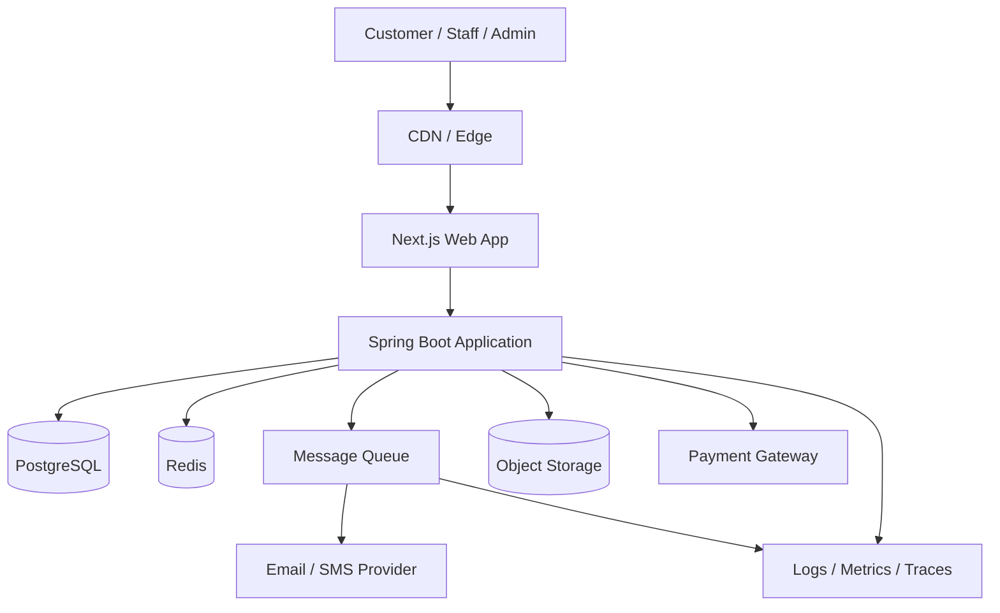
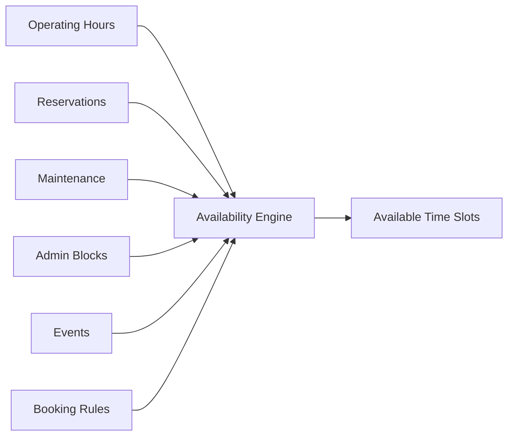
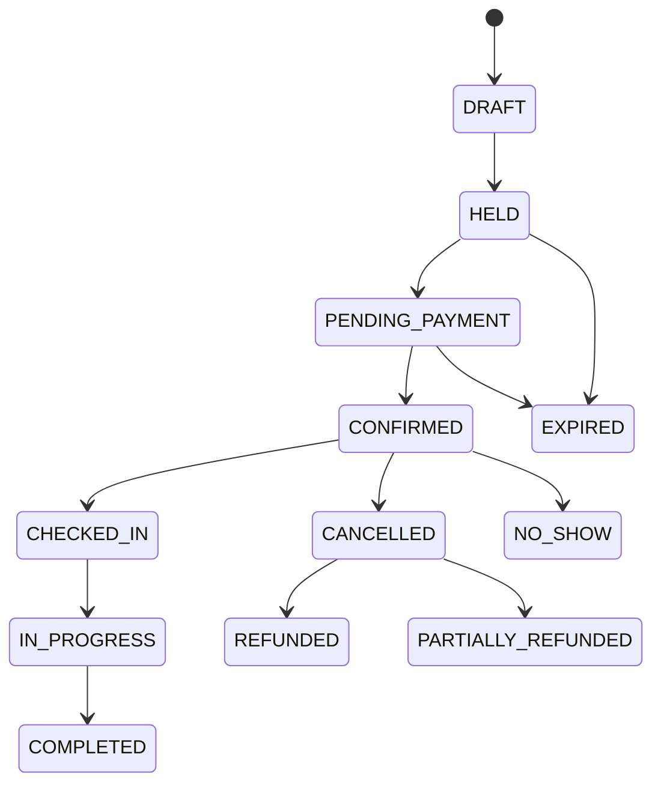
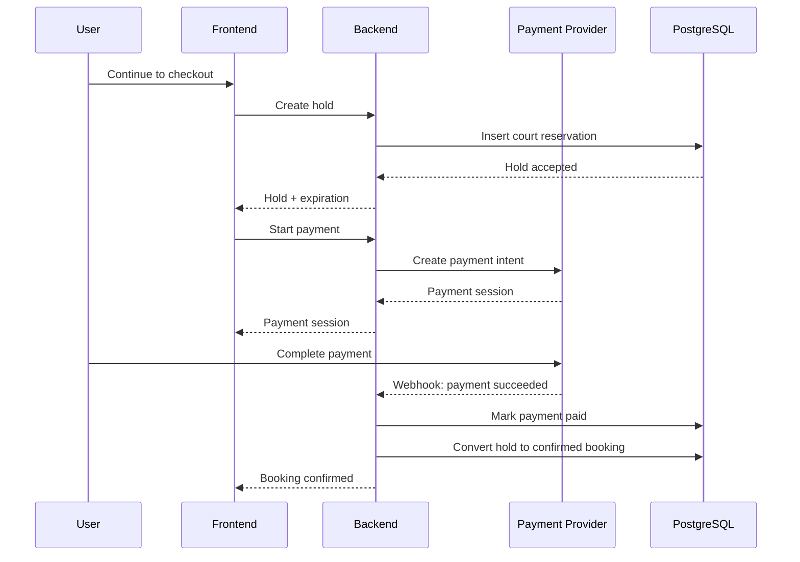
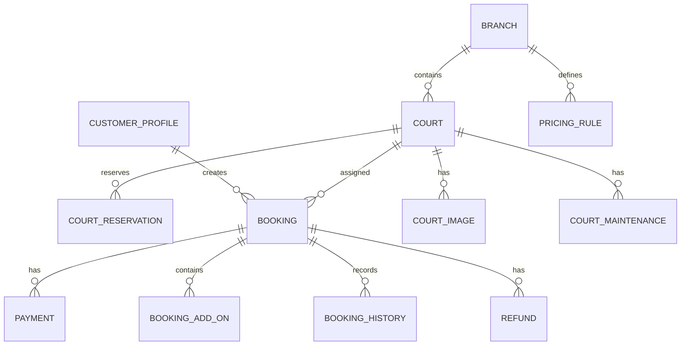
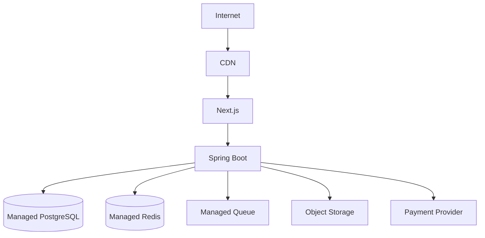

# Pickleball Court Booking Platform
## Solution & Software Architecture

**Architecture Role:** Senior Solutions / Software Architect  
**Frontend:** Next.js + TypeScript + Tailwind CSS  
**Recommended Backend:** Java 21 + Spring Boot 3  
**Primary Database:** PostgreSQL  
**Cache / Temporary Holds:** Redis  
**Async Messaging:** RabbitMQ, AWS SQS, or equivalent  
**Object Storage:** S3-compatible storage  
**Deployment Target:** Containers on Kubernetes / ECS / App Service / VM-based Docker depending on scale  
**Architecture Style:** Modular Monolith First, Event-Driven Where Valuable

---

# 1. Executive Architecture Summary

The Pickleball Court Booking Platform should begin as a **modular monolith with clear bounded modules**, rather than as a distributed microservice architecture.

The system has several workflows where correctness matters more than distribution:

- Court availability
- Prevention of double booking
- Temporary booking holds
- Pricing
- Payment reconciliation
- Cancellation
- Refunds
- Rescheduling

A modular monolith gives the project:

- Faster delivery
- Simpler operations
- Easier transactions
- Lower infrastructure cost
- Easier debugging
- Stronger consistency
- Fewer distributed-system failure modes

The architecture should nevertheless be designed so major domains can later be extracted into services if growth requires it.

Recommended first deployment:

```text
Next.js Web Application
        ↓
Spring Boot API
        ↓
PostgreSQL
   ↙           ↘
Redis       Message Queue
                ↓
      Notification Workers

External Integrations:
Payment Gateway
Email / SMS Provider
Object Storage
Analytics / Monitoring
```

---

# 2. Architectural Goals

The platform must support the following architectural qualities.

## 2.1 Correctness

The same court and time range must never be successfully booked twice.

This is the most important architectural invariant.

## 2.2 Availability

Customers must be able to view current court availability with low latency.

## 2.3 Transaction Safety

Booking, payment, cancellation, and rescheduling workflows must remain consistent even when:

- Network requests are retried
- Payment callbacks are duplicated
- Users refresh pages
- A server crashes
- Multiple customers select the same court simultaneously

## 2.4 Scalability

The architecture should support growth from:

```text
1 branch
6 courts
hundreds of customers
```

to:

```text
many branches
hundreds of courts
tens of thousands of customers
high booking concurrency
```

without requiring a complete redesign.

## 2.5 Maintainability

The codebase should be divided by business capability, not by technical layer alone.

## 2.6 Security

The platform must protect:

- Customer accounts
- Booking information
- Payment records
- Administrative functions
- Audit history

## 2.7 Observability

The system should expose:

- Logs
- Metrics
- Traces
- Error events
- Payment reconciliation metrics
- Booking conflict rates
- Availability latency

---

# 3. High-Level Architecture



---

# 4. Recommended Architecture Style

## 4.1 Modular Monolith

The backend should be one deployable Spring Boot application initially.

Internally, it should be divided into business modules.

Recommended modules:

```text
identity
customer
venue
court
availability
booking
pricing
payment
promotion
membership
notification
maintenance
reporting
audit
admin
```

Each module owns its domain behavior.

Avoid creating packages such as:

```text
controllers/
services/
repositories/
entities/
```

for the entire application.

Instead prefer:

```text
booking/
  api/
  application/
  domain/
  infrastructure/

payment/
  api/
  application/
  domain/
  infrastructure/
```

This keeps domain boundaries explicit.

---

# 5. Why Not Microservices Initially?

Microservices would introduce:

- Distributed transactions
- More deployments
- More monitoring
- More infrastructure
- Network failures
- Event consistency issues
- More DevOps overhead
- More complex local development

A booking platform can support significant traffic as a well-designed modular monolith.

Move to microservices only when measurable needs appear.

Possible future extraction candidates:

```text
Notification Service
Payment Service
Reporting / Analytics
Identity
Availability / Booking
Search
```

---

# 6. Frontend Architecture

## Technology

```text
Next.js
TypeScript
Tailwind CSS
App Router
```

Recommended optional libraries:

```text
zod
react-hook-form
date-fns
lucide-react
clsx
tailwind-merge
```

Do not add state-management libraries unless needed.

---

# 7. Frontend Component Architecture

```text
src/
├── app/
│   ├── book/
│   ├── checkout/
│   ├── bookings/
│   ├── locations/
│   ├── account/
│   └── admin/
│
├── components/
│   ├── booking/
│   ├── checkout/
│   ├── admin/
│   ├── layout/
│   └── ui/
│
├── lib/
│   ├── api/
│   ├── auth/
│   ├── pricing/
│   ├── analytics/
│   └── validation/
│
├── hooks/
├── types/
└── styles/
```

---

# 8. Frontend State Strategy

Use three categories of state.

## 8.1 URL State

Use the URL for search state:

```text
branch
date
time
duration
players
court type
```

Example:

```text
/book?branch=central&date=2026-09-10&time=18:00&duration=120
```

Benefits:

- Shareable
- Refresh safe
- Browser back/forward works
- Deep-linkable

## 8.2 Local UI State

Use React state for:

- Selected card
- Open/closed dialog
- Current tab
- Temporary UI filters

## 8.3 Server State

Availability, pricing, bookings, and payment status must come from backend APIs.

Do not treat client state as authoritative.

---

# 9. Backend Technology

Recommended production backend:

```text
Java 21
Spring Boot 3.x
Spring MVC
Spring Security
Spring Data JPA
Hibernate
Flyway
PostgreSQL
Redis
Micrometer
OpenTelemetry
```

Optional:

```text
MapStruct
Testcontainers
Resilience4j
```

---

# 10. Backend Module Structure

Recommended package structure:

```text
com.company.pickleball
│
├── identity
│   ├── api
│   ├── application
│   ├── domain
│   └── infrastructure
│
├── venue
├── court
├── availability
├── booking
├── pricing
├── payment
├── promotion
├── membership
├── notification
├── maintenance
├── reporting
└── audit
```

---

# 11. Clean / Hexagonal Boundary

Each business module should roughly follow:

```text
API
 ↓
Application Service
 ↓
Domain
 ↓
Ports
 ↓
Infrastructure Adapters
```

Example:

```text
BookingController
      ↓
CreateBookingUseCase
      ↓
Booking Domain
      ↓
BookingRepository Port
      ↓
JpaBookingRepository
```

The domain should not depend directly on HTTP, databases, or payment SDKs.

---

# 12. Core Domain Boundaries

## Identity

Responsibilities:

- Authentication
- Authorization
- Roles
- Permissions
- Session/token validation

## Customer

Responsibilities:

- Customer profile
- Contact information
- Preferences
- Booking history reference

## Venue

Responsibilities:

- Branches
- Operating hours
- Holiday schedules
- Venue metadata

## Court

Responsibilities:

- Court configuration
- Court status
- Amenities
- Court images
- Layout positions

## Availability

Responsibilities:

- Determine available time ranges
- Apply operating hours
- Apply court blocks
- Apply bookings
- Apply maintenance
- Apply booking holds

## Booking

Responsibilities:

- Create hold
- Confirm booking
- Cancel booking
- Reschedule
- Check in
- Mark no-show
- Booking lifecycle

## Pricing

Responsibilities:

- Base price
- Peak/off-peak
- Weekend
- Holiday
- Promotions
- Membership pricing
- Add-ons
- Fees

## Payment

Responsibilities:

- Payment intent
- Gateway interaction
- Webhook processing
- Payment reconciliation
- Refunds
- Idempotency

## Notification

Responsibilities:

- Email
- SMS
- Push
- Booking confirmation
- Reminders
- Cancellations

## Reporting

Responsibilities:

- Revenue
- Utilization
- Booking trends
- Court performance

## Audit

Responsibilities:

- Security-sensitive changes
- Booking overrides
- Pricing changes
- Refunds
- Administrative actions

---

# 13. Core Booking Invariant

The system must guarantee:

> For a given court, two active bookings or active booking holds may not overlap the same time range.

This rule must be enforced at the database level.

Do not rely only on:

- UI availability checks
- Redis locks
- Application-level `SELECT` checks

These mechanisms improve UX but are not sufficient as the final guarantee.

---

# 14. Booking Time Model

Use timestamp ranges.

Recommended fields:

```text
court_id
start_at
end_at
timezone
status
```

Internally, store timestamps in UTC.

Store venue timezone separately.

Example:

```text
venue_timezone = Asia/Manila
```

The application converts local booking times to UTC before persistence.

---

# 15. PostgreSQL Double-Booking Protection

PostgreSQL provides strong tools for time-range collision protection.

Recommended approach:

Use:

```text
tstzrange
```

with a GiST exclusion constraint.

Conceptual table:

```sql
booking (
    id UUID PRIMARY KEY,
    court_id UUID NOT NULL,
    start_at TIMESTAMPTZ NOT NULL,
    end_at TIMESTAMPTZ NOT NULL,
    status VARCHAR(32) NOT NULL
)
```

Conceptual range constraint:

```sql
EXCLUDE USING gist (
    court_id WITH =,
    tstzrange(start_at, end_at, '[)') WITH &&
)
```

Only statuses that actively reserve inventory should participate.

Examples:

```text
HELD
PENDING_PAYMENT
CONFIRMED
CHECKED_IN
IN_PROGRESS
```

Statuses such as:

```text
CANCELLED
EXPIRED
REFUNDED
```

should not block availability.

The exact PostgreSQL implementation can use:

- Partial exclusion constraint
- Separate reservation table
- Dedicated `court_reservations` table

---

# 16. Recommended Reservation Table

For cleaner concurrency handling, separate inventory reservation from business booking.

```text
court_reservation
-----------------
id
court_id
booking_id
hold_token
reservation_type
start_at
end_at
expires_at
status
created_at
updated_at
```

Reservation types:

```text
HOLD
BOOKING
MAINTENANCE
EVENT
ADMIN_BLOCK
```

This table becomes the source of truth for court occupancy.

---

# 17. Availability Calculation

Availability should be calculated as:

```text
Venue Operating Hours
-
Court Reservations
-
Maintenance
-
Admin Blocks
-
Events
-
Booking Buffer
=
Available Intervals
```

Conceptual flow:



---

# 18. Temporary Booking Holds

When a customer clicks **Continue to Checkout**:

1. Client sends selected court/time.
2. Backend revalidates the request.
3. Backend attempts to insert an active reservation.
4. Database exclusion constraint verifies no overlap.
5. A booking hold is created.
6. Hold expiration is returned to the client.
7. Checkout begins.

Example:

```text
hold duration = 10 minutes
```

Hold duration should be configurable.

---

# 19. Hold Expiration

Recommended fields:

```text
status = HELD
expires_at = current_time + hold_duration
```

Two mechanisms should clear expired holds.

## Lazy expiration

Availability queries ignore expired holds.

## Background cleanup

A scheduled worker periodically changes:

```text
HELD → EXPIRED
```

Do not depend exclusively on the cleanup process for correctness.

---

# 20. Redis Usage

Redis is useful for:

- Fast availability cache
- Rate limiting
- Session data
- Distributed cache
- Short-lived checkout metadata
- Idempotency response caching

Redis must **not** be the final source of truth for court ownership.

PostgreSQL remains authoritative.

---

# 21. Availability Cache

Recommended cache key:

```text
availability:{branchId}:{date}
```

or:

```text
availability:{courtId}:{date}
```

TTL:

```text
30–60 seconds
```

Invalidate cache on:

- Booking created
- Hold created
- Booking cancelled
- Hold expired
- Court blocked
- Maintenance added
- Pricing/operating schedule changes

If cache invalidation fails, availability must still be revalidated before booking.

---

# 22. Booking State Machine

Recommended booking lifecycle:



State transitions must be validated server-side.

---

# 23. Booking Aggregate

Recommended booking aggregate:

```text
Booking
├── BookingId
├── BookingReference
├── CustomerId
├── BranchId
├── CourtId
├── BookingPeriod
├── BookingStatus
├── PriceSnapshot
├── PaymentStatus
├── Participants
├── AddOns
└── Audit Metadata
```

The booking must store a price snapshot.

Do not recalculate historical bookings using current prices.

---

# 24. Price Snapshot

Persist:

```text
base_rate
duration
subtotal
discounts
taxes
fees
add_ons
total
currency
pricing_rule_ids
```

This allows future price changes without altering past bookings.

---

# 25. Pricing Architecture

The pricing engine should accept:

```text
branch
court
date
time
duration
customer
membership
promotion
add-ons
```

and return:

```text
base
modifiers
discounts
fees
tax
total
```

Example:

```json
{
  "currency": "PHP",
  "baseAmount": 1200,
  "adjustments": [
    {
      "type": "PEAK_RATE",
      "amount": 200
    },
    {
      "type": "PROMOTION",
      "amount": -100
    }
  ],
  "fees": 50,
  "total": 1350
}
```

---

# 26. Payment Architecture

Do not directly collect or store raw card details.

Use a payment provider.

Possible providers depend on target market.

The backend should expose an abstraction:

```java
public interface PaymentGateway {
    PaymentIntent createPaymentIntent(...);
    PaymentStatus getPaymentStatus(...);
    RefundResult refund(...);
}
```

Provider-specific code belongs in infrastructure adapters.

---

# 27. Payment Flow



---

# 28. Payment Webhook Rules

Payment webhooks must be:

- Authenticated/verified
- Idempotent
- Persisted
- Retry safe

Store:

```text
provider_event_id
event_type
payload_hash
processed_at
processing_status
```

Unique constraint:

```text
provider_event_id
```

Duplicate webhook:

```text
return 200
do not process twice
```

---

# 29. Payment Reconciliation

Critical failure case:

```text
Payment succeeds
but confirmation logic crashes.
```

Architecture must recover.

Use:

- Durable payment transaction
- Webhook retry
- Reconciliation job

Scheduled reconciliation checks:

```text
PENDING payment
Gateway says PAID
Booking not confirmed
```

and repairs the state safely.

---

# 30. Idempotency

Any important mutation API should support idempotency.

Examples:

```text
POST /booking-holds
POST /bookings
POST /payments
POST /refunds
POST /reschedules
```

Client sends:

```http
Idempotency-Key: 0f4...
```

Backend stores:

```text
key
operation
request_hash
response
status
expires_at
```

This prevents accidental duplicate operations caused by retries.

---

# 31. Async Event Architecture

Use asynchronous events for operations that do not need to block the user.

Examples:

```text
BookingConfirmed
BookingCancelled
BookingRescheduled
PaymentReceived
RefundCompleted
CustomerCheckedIn
CourtMaintenanceScheduled
```

Consumers can handle:

- Email
- SMS
- Push
- Analytics
- Reporting projections
- Audit enrichment

---

# 32. Transactional Outbox Pattern

Do not publish messages directly after a database commit and assume success.

Use an outbox.

Inside the same transaction:

```text
1. Update booking
2. Insert outbox event
3. Commit
```

Background publisher sends the event to the message broker.

Outbox table:

```text
outbox_event
------------
id
aggregate_type
aggregate_id
event_type
payload
created_at
published_at
status
```

This prevents:

```text
database committed
message lost
```

---

# 33. Notification Architecture

Notification module consumes domain events.

Example:

```text
BookingConfirmed
    ↓
Notification Consumer
    ↓
Email Template
    ↓
Email Provider
```

Do not send emails synchronously inside booking transactions.

Notification failure should never roll back a successful booking.

---

# 34. Court Images

Store images in S3-compatible object storage.

Database stores metadata only:

```text
court_image
-----------
id
court_id
object_key
display_order
alt_text
created_at
```

Serve through:

- CDN
- Signed URL
- Public optimized delivery depending on privacy

---

# 35. Authentication Architecture

Recommended options:

## Option A — Managed Identity

Use:

```text
Auth0
AWS Cognito
Clerk
Keycloak
Microsoft Entra External ID
```

Advantages:

- Faster
- Mature security
- MFA support
- Password reset
- OAuth/social login

## Option B — Custom Authentication

If building internally:

- BCrypt/Argon2 password hashing
- Short-lived access token
- Rotating refresh token
- Refresh-token revocation
- MFA optional
- Secure cookie where appropriate

For most implementations, managed identity is preferred unless there is a strong business reason otherwise.

---

# 36. Authorization

Use RBAC.

Recommended roles:

```text
CUSTOMER
RECEPTIONIST
COURT_MANAGER
FINANCE
ADMIN
OWNER
```

Permission examples:

```text
BOOKING_VIEW_OWN
BOOKING_CREATE
BOOKING_OVERRIDE
BOOKING_CANCEL_ANY
COURT_EDIT
COURT_BLOCK
PRICE_EDIT
PAYMENT_REFUND
REPORT_VIEW
USER_MANAGE
```

Backend authorization is mandatory.

Frontend hiding is only UX.

---

# 37. Database Architecture

Primary database:

```text
PostgreSQL
```

Reasons:

- Strong transactions
- Range types
- Exclusion constraints
- JSONB where helpful
- Mature indexing
- Excellent reliability
- Strong reporting capabilities

---

# 38. Major Database Tables

Recommended core tables:

```text
user_account
role
permission
user_role

customer_profile

branch
branch_operating_hours
branch_holiday

court
court_image
court_amenity
court_layout_position

court_reservation
court_block
court_maintenance

booking
booking_participant
booking_add_on
booking_price_adjustment
booking_history

pricing_rule
promotion
promotion_usage

payment
payment_event
refund

membership_plan
membership
membership_credit

waitlist

notification
notification_delivery

audit_log

outbox_event
idempotency_record
```

---

# 39. Simplified Entity Relationship Diagram



---

# 40. API Style

Recommended:

```text
REST API
JSON
```

REST is sufficient for the initial platform.

Use OpenAPI documentation.

Base:

```text
/api/v1
```

---

# 41. Customer APIs

## Locations

```http
GET /api/v1/branches
GET /api/v1/branches/{branchId}
```

## Courts

```http
GET /api/v1/branches/{branchId}/courts
GET /api/v1/courts/{courtId}
```

## Availability

```http
GET /api/v1/availability
```

Parameters:

```text
branchId
date
startTime
durationMinutes
courtType
```

## Pricing

```http
POST /api/v1/pricing/quote
```

## Hold

```http
POST /api/v1/booking-holds
```

## Checkout

```http
POST /api/v1/bookings/{bookingId}/payment-intent
```

## Bookings

```http
GET  /api/v1/bookings
GET  /api/v1/bookings/{bookingId}
POST /api/v1/bookings/{bookingId}/cancel
POST /api/v1/bookings/{bookingId}/reschedule
```

---

# 42. Example Availability API

Request:

```http
GET /api/v1/availability?branchId=central&date=2026-09-10&startTime=18:00&durationMinutes=120
```

Response:

```json
{
  "branchId": "central",
  "date": "2026-09-10",
  "startTime": "18:00",
  "durationMinutes": 120,
  "courts": [
    {
      "courtId": "court-01",
      "name": "Court One",
      "status": "AVAILABLE",
      "price": {
        "currency": "PHP",
        "amount": 1300
      }
    },
    {
      "courtId": "court-02",
      "name": "Court Two",
      "status": "BOOKED"
    }
  ]
}
```

---

# 43. Create Hold API

Request:

```http
POST /api/v1/booking-holds
Idempotency-Key: <uuid>
```

```json
{
  "branchId": "central",
  "courtId": "court-01",
  "date": "2026-09-10",
  "startTime": "18:00",
  "durationMinutes": 120,
  "players": 4
}
```

Success:

```json
{
  "bookingId": "bkg_123",
  "bookingReference": "PKL-260910-1234",
  "status": "HELD",
  "expiresAt": "2026-09-10T10:10:00Z",
  "price": {
    "currency": "PHP",
    "total": 1350
  }
}
```

Conflict:

```http
409 Conflict
```

```json
{
  "code": "COURT_NO_LONGER_AVAILABLE",
  "message": "The selected court is no longer available."
}
```

---

# 44. API Error Standard

Use a consistent error envelope.

Example:

```json
{
  "timestamp": "2026-09-10T10:01:15Z",
  "status": 409,
  "code": "COURT_NO_LONGER_AVAILABLE",
  "message": "The selected court is no longer available.",
  "traceId": "abc123"
}
```

Do not expose internal stack traces.

---

# 45. API Versioning

Use:

```text
/api/v1
```

Do not version every minor behavior change.

Version only breaking contract changes.

---

# 46. Admin APIs

Examples:

```http
GET  /api/v1/admin/bookings
POST /api/v1/admin/bookings

GET  /api/v1/admin/courts
POST /api/v1/admin/courts
PUT  /api/v1/admin/courts/{courtId}

POST /api/v1/admin/courts/{courtId}/blocks
POST /api/v1/admin/courts/{courtId}/maintenance

GET  /api/v1/admin/reports/utilization
GET  /api/v1/admin/reports/revenue

POST /api/v1/admin/refunds
```

Admin APIs must enforce role permissions.

---

# 47. Rescheduling Architecture

Rescheduling must be atomic.

Safe flow:

```text
1. Validate booking can be rescheduled
2. Validate target court/time
3. Calculate price difference
4. Create temporary reservation for new slot
5. Process additional payment if required
6. Replace old reservation
7. Release old slot
8. Update booking
9. Create audit record
10. Publish BookingRescheduled event
```

Do not release the old slot before the new slot is secured.

---

# 48. Cancellation Architecture

Flow:

```text
1. Retrieve booking
2. Validate cancellation policy
3. Calculate refund
4. Mark booking cancellation pending if refund required
5. Release court reservation
6. Initiate refund
7. Update payment/refund state
8. Publish cancellation event
```

Exact sequencing depends on business policy.

If refunds can fail, booking cancellation must not silently revert.

---

# 49. Check-In Architecture

Check-in endpoints:

```http
POST /api/v1/bookings/{bookingId}/check-in
```

QR code may contain:

```text
booking reference
signed lookup token
```

Do not put sensitive customer data directly in QR payload.

Validate:

- Booking exists
- Correct branch
- Booking status
- Check-in time window

---

# 50. Waitlist Architecture

Waitlist should be asynchronous.

When a slot becomes free:

```text
BookingCancelled
    ↓
Waitlist Matcher
    ↓
Eligible Waitlist Entry
    ↓
Notification
```

Future advanced mode:

Create a short offer hold:

```text
WAITLIST_OFFER
expires in 10 minutes
```

---

# 51. Reporting Architecture

Do not run expensive analytics against hot booking queries as usage grows.

Phase 1:

Use PostgreSQL reporting queries.

Phase 2:

Create reporting projections asynchronously.

Example:

```text
BookingConfirmed
   ↓
Reporting Consumer
   ↓
daily_court_metrics
daily_branch_metrics
```

Possible future warehouse:

```text
BigQuery
Snowflake
Redshift
ClickHouse
```

Only introduce if justified.

---

# 52. Search Architecture

Initial search can be handled by PostgreSQL.

Do not introduce Elasticsearch/OpenSearch for simple court discovery.

Future search engine may be justified for:

- Hundreds of venues
- Geographic search
- Full-text discovery
- Complex recommendations

---

# 53. Deployment Architecture — MVP

Recommended simple production deployment:



Possible hosting options:

Frontend:

```text
Vercel
AWS
Azure
Container hosting
```

Backend:

```text
AWS ECS/Fargate
Azure Container Apps
Google Cloud Run
Kubernetes
Docker VM
```

Database:

Use managed PostgreSQL where possible.

---

# 54. Kubernetes Deployment — Growth Stage

For larger environments:

```text
Ingress
  ↓
Next.js Deployment
  ↓
Spring Boot API Deployment
  ↓
PostgreSQL
Redis
RabbitMQ
Workers
```

Recommended Kubernetes objects:

```text
Deployment
Service
Ingress
ConfigMap
Secret
HorizontalPodAutoscaler
PodDisruptionBudget
NetworkPolicy
```

Do not use Kubernetes merely because it exists.

For an MVP, managed containers may be simpler.

---

# 55. Environment Strategy

Use:

```text
local
development
staging
production
```

Optional:

```text
preview environments
```

Each environment must have independent:

- Database
- Redis
- Payment credentials
- Storage bucket
- Email credentials

Never share production database with development.

---

# 56. CI/CD

Recommended pipeline:

```text
Pull Request
   ↓
Lint
   ↓
Unit Tests
   ↓
Build
   ↓
Integration Tests
   ↓
Security Scan
   ↓
Container Build
   ↓
Deploy Staging
   ↓
Smoke Test
   ↓
Production Promotion
```

---

# 57. Database Migration Strategy

Use:

```text
Flyway
```

Rules:

- Migrations are immutable after deployment
- Forward-only changes preferred
- Backward-compatible rollout for risky schema changes
- Index creation planned for large tables
- Production backups before major migration

---

# 58. Testing Architecture

## Frontend

```text
Unit / component tests
Integration tests
E2E booking flow
Accessibility checks
```

Recommended:

```text
Vitest / Jest
React Testing Library
Playwright
```

## Backend

```text
JUnit 5
Mockito
Spring Boot Test
Testcontainers
```

Critical tests:

- Overlapping booking prevention
- Hold expiration
- Duplicate webhook handling
- Payment reconciliation
- Rescheduling concurrency
- Refund state
- Pricing snapshot
- Authorization

---

# 59. Critical Concurrency Tests

Automated tests must simulate:

```text
100 concurrent attempts
same court
same time
```

Expected:

```text
1 successful hold
99 conflicts
```

This is a key release requirement.

---

# 60. Security Architecture

Follow OWASP principles.

Controls:

- HTTPS only
- Secure headers
- Content Security Policy
- Authentication
- RBAC
- Input validation
- Rate limiting
- CSRF protection where applicable
- Secure cookies
- Short token lifetime
- Refresh-token rotation
- Parameterized SQL/JPA
- Audit logging
- Secret management
- Dependency scanning

---

# 61. Secrets

Never store secrets in source code.

Use:

```text
AWS Secrets Manager
Azure Key Vault
GCP Secret Manager
Kubernetes Secrets + external secret manager
```

Local:

```text
.env.local
```

must not be committed.

---

# 62. Payment Security

The application should aim to reduce PCI scope.

Use payment-provider hosted components or checkout.

Never log:

- Card numbers
- CVV
- Full sensitive gateway payloads

Redact sensitive payment data from logs.

---

# 63. PII Handling

Classify:

```text
Name
Email
Phone
Booking history
Payment metadata
```

Implement:

- Encryption in transit
- Managed DB encryption at rest
- Access controls
- Audit trails
- Retention policy
- Account deletion process

---

# 64. Audit Logging

Audit log fields:

```text
id
actor_user_id
actor_role
action
entity_type
entity_id
old_values
new_values
ip_address
user_agent
trace_id
created_at
```

Audit:

- Refund
- Booking override
- Court block
- Pricing change
- User permission change
- Manual payment adjustment

---

# 65. Observability

Use structured logging.

Recommended JSON log fields:

```text
timestamp
level
service
traceId
spanId
userId
bookingId
courtId
event
message
```

Never log sensitive payment or authentication data.

---

# 66. Metrics

Recommended business metrics:

```text
booking_hold_created_total
booking_hold_conflict_total
booking_confirmed_total
booking_cancelled_total
payment_success_total
payment_failure_total
refund_total
availability_request_duration
court_utilization
```

Technical:

```text
HTTP latency
HTTP 5xx
DB pool usage
Redis errors
Queue lag
JVM memory
GC
CPU
```

---

# 67. Distributed Tracing

Use:

```text
OpenTelemetry
```

Trace important flows:

```text
Availability Search
Create Hold
Checkout
Payment Webhook
Booking Confirmation
Cancellation
Refund
```

---

# 68. Alerting

Critical alerts:

```text
High 5xx rate
Payment webhook failures
Booking confirmation failures
Database unavailable
Redis unavailable
Queue backlog
High booking conflict anomaly
Failed reconciliation jobs
Disk / storage issues
```

---

# 69. Backup & Disaster Recovery

Database:

- Automated backups
- Point-in-time recovery
- Tested restore procedure

Recommended initial targets:

```text
RPO: 15 minutes or better
RTO: 2 hours or better
```

Final values depend on business requirements.

Object storage:

Enable versioning where appropriate.

---

# 70. Failure Handling

## Redis Unavailable

System should:

- Fall back to database availability
- Disable cache
- Continue booking safely

## Message Queue Unavailable

Booking should:

- Still commit
- Outbox remains pending
- Publisher retries later

## Email Provider Unavailable

Booking remains confirmed.

Notification retries asynchronously.

## Payment Provider Slow

Use timeout.

Return user-friendly state.

Reconcile asynchronously.

---

# 71. Graceful Degradation

The booking system should prioritize:

```text
Correct reservation
over
perfect convenience
```

If optional dependencies fail:

```text
Analytics unavailable → booking continues
Email unavailable → booking continues
Cache unavailable → booking continues slower
```

If critical dependencies fail:

```text
Database unavailable → booking unavailable
Payment unavailable → paid checkout unavailable
```

---

# 72. Rate Limiting

Apply rate limits to:

```text
Login
Registration
Password reset
Availability search
Create hold
Payment intent
Promo validation
```

Use:

- IP
- User ID
- Endpoint class

Avoid limits that block normal booking behavior.

---

# 73. Performance Targets

Initial targets:

```text
Availability search:
p95 < 500 ms backend

Create hold:
p95 < 750 ms

Booking read:
p95 < 300 ms

Frontend:
LCP < 2.5 s
INP < 200 ms
CLS < 0.1
```

Actual SLOs should be measured and adjusted.

---

# 74. Indexing Strategy

Important PostgreSQL indexes:

```text
court(branch_id, status)

booking(customer_id, created_at)

booking(court_id, start_at)

court_reservation(court_id, start_at, end_at)

payment(booking_id)

payment(provider_reference)

audit_log(entity_type, entity_id)

outbox_event(status, created_at)
```

Use GiST indexes for time-range overlap checks.

---

# 75. Data Retention

Define retention policies for:

```text
Audit logs
Payment webhooks
Notifications
Idempotency keys
Expired holds
Application logs
Analytics data
```

Example:

```text
Expired holds:
retain 30–90 days or archive

Idempotency:
24 hours–7 days depending on operation

Payment records:
retain according to accounting/legal requirements
```

---

# 76. Multi-Branch Architecture

Model:

```text
Organization
   ↓
Branch
   ↓
Court
```

Every relevant operational record should be branch-aware.

Examples:

```text
Pricing
Operating hours
Court
Booking
Maintenance
Staff assignment
Reports
```

Do not hard-code single-branch assumptions.

---

# 77. Multi-Tenancy Future Option

If the platform may later become SaaS for multiple businesses:

Introduce:

```text
tenant_id
```

at major aggregate boundaries.

Potential hierarchy:

```text
Tenant
  ↓
Organization
  ↓
Branch
  ↓
Court
```

Do not implement full multi-tenancy unless the product roadmap requires it.

However, avoid database design that makes it impossible later.

---

# 78. Domain Events

Recommended domain events:

```text
CourtHoldCreated
CourtHoldExpired
BookingConfirmed
BookingCancelled
BookingRescheduled
BookingCheckedIn
BookingCompleted
PaymentInitiated
PaymentSucceeded
PaymentFailed
RefundRequested
RefundCompleted
CourtBlocked
CourtMaintenanceScheduled
PromotionRedeemed
```

---

# 79. Event Versioning

Events should include:

```text
eventId
eventType
eventVersion
occurredAt
aggregateId
correlationId
payload
```

Example:

```json
{
  "eventId": "evt_123",
  "eventType": "BookingConfirmed",
  "eventVersion": 1,
  "occurredAt": "2026-09-10T10:02:00Z",
  "aggregateId": "bkg_123",
  "correlationId": "trace_123",
  "payload": {}
}
```

---

# 80. Architecture Decision Records

Maintain:

```text
docs/architecture/adr/
```

Examples:

```text
ADR-001 Modular Monolith
ADR-002 PostgreSQL as Source of Truth
ADR-003 Database-Level Overlap Protection
ADR-004 Redis Used Only as Optimization
ADR-005 Transactional Outbox
ADR-006 REST API
ADR-007 Managed Payment Gateway
ADR-008 UTC Persistence + Venue Timezone
```

---

# 81. Recommended Repository Structure

Possible monorepo:

```text
pickleball-platform/
│
├── apps/
│   ├── web/
│   │   └── Next.js
│   │
│   └── api/
│       └── Spring Boot
│
├── docs/
│   ├── requirements/
│   ├── architecture/
│   ├── api/
│   └── adr/
│
├── infrastructure/
│   ├── docker/
│   ├── kubernetes/
│   └── terraform/
│
└── README.md
```

Alternative:

Separate frontend/backend repositories are also acceptable.

For a small team, monorepo can simplify coordination.

---

# 82. Local Development

Recommended Docker Compose:

```text
PostgreSQL
Redis
RabbitMQ
Mail testing service
```

Example:

```text
docker compose up -d
```

Run:

```text
Next.js locally
Spring Boot locally
```

This provides fast development while infrastructure dependencies remain containerized.

---

# 83. API Documentation

Use:

```text
OpenAPI 3
```

Provide:

```text
Swagger UI
```

Contract should document:

- Request
- Response
- Error codes
- Authentication
- Idempotency
- Pagination

---

# 84. Pagination

Admin list APIs should use pagination.

Example:

```http
GET /api/v1/admin/bookings?page=0&size=25
```

For high-volume event history, cursor pagination may be preferable later.

---

# 85. Date / Time Rules

The venue owns a timezone.

Example:

```text
Asia/Manila
```

UI uses venue-local time.

Backend converts to UTC.

Store:

```text
start_at UTC
end_at UTC
```

Venue displays:

```text
local date/time
```

Never depend on browser timezone for authoritative booking timestamps.

---

# 86. Booking Boundary Semantics

Use half-open intervals:

```text
[start, end)
```

Example:

```text
10:00–11:00
11:00–12:00
```

These bookings do not overlap.

This simplifies back-to-back bookings.

If a buffer is required:

```text
actual reservation range =
booking range + configured buffer
```

---

# 87. Booking Buffer

Example business configuration:

```text
booking duration:
18:00–19:00

cleanup buffer:
15 minutes

reserved inventory:
18:00–19:15
```

Buffer should be modeled explicitly.

Do not hide buffer rules inside frontend code.

---

# 88. Maintenance Modeling

Maintenance is an inventory reservation.

Example:

```text
reservation_type = MAINTENANCE
court_id = 4
start = 12:00
end = 16:00
```

Availability engine does not need special collision logic.

All occupancy types use the same reservation model.

This reduces complexity.

---

# 89. Event / Tournament Reservations

Tournament or event blocks also use:

```text
court_reservation
```

Reservation type:

```text
EVENT
```

Multi-court events create multiple reservations.

---

# 90. Admin Overrides

Administrative override must:

- Require permission
- Require reason
- Create audit log
- Warn if customers are affected
- Never silently overwrite a confirmed booking

---

# 91. Booking Reference

Use a public-friendly booking reference.

Example:

```text
PKL-260910-1234
```

Do not expose sequential database IDs.

Internally use UUID.

---

# 92. IDs

Recommended:

```text
UUID
```

or:

```text
UUIDv7
```

for primary keys.

Public references remain separate.

---

# 93. Soft Delete

Do not soft-delete every table automatically.

Recommended:

- Booking: never physically delete normally
- Payment: never delete normally
- Audit: append-only
- Court: deactivate instead of deleting if historical references exist
- Temporary draft data: may be deleted

---

# 94. Optimistic vs Pessimistic Concurrency

Use database uniqueness/exclusion as the final booking guard.

For administrative entity editing:

Use optimistic locking.

Example:

```java
@Version
private long version;
```

This can prevent two managers from accidentally overwriting court configuration.

---

# 95. Saga Requirement

A distributed saga is not necessary in the initial modular monolith.

Use normal database transactions where possible.

External payment cannot participate in DB transactions.

Handle this using:

- Explicit state machine
- Idempotency
- Webhooks
- Reconciliation

This is simpler than adding a saga framework.

---

# 96. Caching Strategy Summary

Cache:

```text
Venue metadata
Court metadata
Availability read models
Pricing reference data
```

Do not cache:

```text
authoritative booking confirmation state
payment truth
uncommitted reservation truth
```

---

# 97. CDN Strategy

Serve through CDN:

```text
Court images
Static assets
Next.js assets
Public marketing assets
```

Set cache headers appropriately.

Dynamic availability must not be cached publicly for long periods.

---

# 98. Logging Correlation

Frontend may generate:

```text
X-Correlation-ID
```

Backend propagates:

```text
trace ID
```

Payment events should associate:

```text
booking ID
payment ID
provider reference
trace ID
```

This dramatically improves incident investigation.

---

# 99. Feature Flags

Use feature flags for risky features such as:

```text
Waitlist
Dynamic pricing
Membership credit
Online refunds
New payment gateway
Recurring booking
```

Do not build a complex feature-flag platform initially.

Simple configuration may be sufficient.

---

# 100. Architecture Evolution Plan

## Phase 1 — MVP

```text
Next.js
Spring Boot modular monolith
PostgreSQL
Redis
Payment gateway
Email
Object storage
```

## Phase 2 — Operational Growth

Add:

```text
Message broker
Transactional outbox
Notification worker
Advanced reporting
Better caching
Observability stack
```

The outbox pattern may be introduced in Phase 1 if notifications/payment events are already business-critical.

## Phase 3 — Scale

Potential extraction:

```text
Notification Service
Reporting Service
Payment Integration Service
Availability / Booking Service
```

Only extract based on:

- Team ownership
- Scaling requirements
- Deployment independence
- Reliability isolation

---

# 101. Recommended MVP Infrastructure

For a modest first release:

```text
Frontend:
Vercel or container-hosted Next.js

Backend:
1–2 Spring Boot instances

Database:
Managed PostgreSQL

Redis:
Managed Redis

Storage:
S3-compatible

Email:
Managed provider

Payment:
Managed provider
```

This supports a significant initial user base without unnecessary complexity.

---

# 102. Production Readiness Checklist

## Booking Correctness

- [ ] Database overlap prevention exists
- [ ] Hold expiration works
- [ ] Booking conflict returns HTTP 409
- [ ] Concurrency test passes
- [ ] Back-to-back booking semantics verified
- [ ] Maintenance blocks use same reservation model

## Payments

- [ ] Webhooks verified
- [ ] Webhook processing idempotent
- [ ] Duplicate events tested
- [ ] Reconciliation job exists
- [ ] Refund failure handled
- [ ] Raw card data never stored

## Security

- [ ] HTTPS
- [ ] RBAC
- [ ] Secrets externalized
- [ ] Rate limiting
- [ ] Audit logs
- [ ] Security headers
- [ ] Dependency scanning

## Reliability

- [ ] DB backups
- [ ] Restore tested
- [ ] Health checks
- [ ] Queue retries
- [ ] Outbox retries
- [ ] Cache failure fallback

## Observability

- [ ] Structured logs
- [ ] Metrics
- [ ] Tracing
- [ ] Alerts
- [ ] Correlation IDs

---

# 103. Codex Architecture Implementation Instructions

The following instructions can be given directly to Codex.

---

## CODEX MASTER ARCHITECTURE INSTRUCTION

Implement the application according to this architecture.

### Required Stack

Frontend:

```text
Next.js
TypeScript
Tailwind CSS
```

Backend:

```text
Java 21
Spring Boot 3
PostgreSQL
Redis
```

Do not implement microservices initially.

Build a modular monolith with strong module boundaries.

---

# 104. Codex Backend Project Structure

Create:

```text
apps/api/
```

Recommended:

```text
src/main/java/com/company/pickleball/
```

Modules:

```text
identity
customer
venue
court
availability
booking
pricing
payment
promotion
notification
maintenance
reporting
audit
shared
```

Each module should contain:

```text
api
application
domain
infrastructure
```

Do not create one global controllers package and one global services package.

---

# 105. Codex Database Implementation Order

Implement migrations in this order:

```text
1. users / roles
2. branch
3. court
4. court amenities / images
5. operating hours
6. court reservation
7. booking
8. price snapshot
9. payment
10. maintenance
11. audit
12. outbox
13. idempotency
```

Use Flyway.

---

# 106. Codex Booking Concurrency Rule

Before building checkout:

Implement database-level booking overlap protection.

Do not rely solely on:

```text
Redis
synchronized
Java locks
frontend checks
```

PostgreSQL must be the final concurrency authority.

Write integration tests using Testcontainers.

Required test:

```text
multiple concurrent hold requests
same court
same time
```

Only one must succeed.

---

# 107. Codex Availability Endpoint

Implement:

```http
GET /api/v1/availability
```

Availability must consider:

```text
operating hours
active reservations
maintenance
admin blocks
events
hold expiry
```

The result should include price quote or enough information to request one.

---

# 108. Codex Hold Endpoint

Implement:

```http
POST /api/v1/booking-holds
```

Behavior:

```text
validate request
convert venue local time to UTC
calculate price
attempt reservation insert
handle overlap
create booking HELD
return expiration
```

Return:

```text
409 COURT_NO_LONGER_AVAILABLE
```

on conflict.

---

# 109. Codex Payment Boundary

Create a port:

```java
PaymentGateway
```

Do not couple application logic directly to a specific payment provider SDK.

Create:

```text
MockPaymentGateway
```

for local development.

Provider implementation can be added later.

---

# 110. Codex Outbox

Implement an outbox abstraction.

When booking is confirmed:

```text
booking update
+
BookingConfirmed outbox record
```

must commit together.

Create a publisher job.

For early MVP, the publisher may run inside the same application.

---

# 111. Codex API Contract

Use:

```text
/api/v1
```

Create consistent error responses.

Document API using OpenAPI.

Do not expose JPA entities directly from controllers.

Use DTOs.

---

# 112. Codex Testing Requirements

Required backend integration tests:

```text
create hold
overlap conflict
expired hold ignored
confirm booking
cancel booking
reschedule
duplicate payment webhook
payment reconciliation
maintenance collision
RBAC
```

---

# 113. Codex Frontend Integration Rules

Frontend must:

- Read search state from URL
- Request availability from backend
- Never assume client availability is final
- Create hold before checkout
- Display hold expiration
- Handle HTTP 409 gracefully
- Refresh availability after conflict
- Preserve booking ID through checkout

---

# 114. Codex Error UX Mapping

Map API codes:

```text
COURT_NO_LONGER_AVAILABLE
→ Court was just booked. Refresh availability.

HOLD_EXPIRED
→ Your reservation hold expired.

PAYMENT_FAILED
→ Payment could not be completed.

BOOKING_NOT_CANCELLABLE
→ Cancellation window has passed.

PROMO_INVALID
→ Promotion cannot be applied.
```

Do not display raw backend exception text.

---

# 115. Final Architectural Recommendation

Use the following production architecture for the first serious release:

```text
                         ┌────────────────────────────┐
                         │      Customer Browser      │
                         └─────────────┬──────────────┘
                                       │
                                       ▼
                         ┌────────────────────────────┐
                         │   CDN / Edge / Next.js     │
                         └─────────────┬──────────────┘
                                       │ HTTPS
                                       ▼
                  ┌────────────────────────────────────────┐
                  │       Spring Boot Modular Monolith     │
                  │                                        │
                  │ Identity      Venue       Court        │
                  │ Availability  Booking     Pricing      │
                  │ Payment       Promotion   Maintenance  │
                  │ Notification  Reporting   Audit        │
                  └────────┬──────────┬──────────┬─────────┘
                           │          │          │
                    ┌──────▼───┐  ┌──▼────┐  ┌──▼─────────┐
                    │PostgreSQL│  │ Redis │  │Message Queue│
                    └──────────┘  └───────┘  └─────┬──────┘
                                                   │
                                                   ▼
                                    ┌─────────────────────────┐
                                    │ Notification / Workers  │
                                    └─────────────────────────┘

External:
Payment Gateway
Email / SMS Provider
Object Storage
Monitoring / Analytics
```

The most important technical decision is:

> **PostgreSQL must remain the final authority for court-time reservation conflicts.**

Redis, frontend state, and availability caches improve performance and user experience, but the database must enforce the no-double-booking rule.

The second major recommendation is:

> **Start with a modular monolith and extract services only when scaling, organizational ownership, or deployment isolation provides a measurable benefit.**

This architecture gives the product a strong foundation for MVP delivery while preserving a clear path toward a multi-branch, high-volume booking platform.

---

# 116. Architecture Definition of Done

The architecture is ready for implementation when:

1. Backend module boundaries are established.
2. Database schema is designed.
3. Court reservation overlap protection is proven.
4. Availability API contract is defined.
5. Hold lifecycle is defined.
6. Booking state machine is enforced.
7. Pricing snapshots are persisted.
8. Payment gateway is abstracted.
9. Idempotency is implemented.
10. Webhooks are retry-safe.
11. Reconciliation strategy exists.
12. Async notifications use durable events/outbox.
13. RBAC is enforced.
14. Audit logs exist.
15. Frontend understands hold/conflict states.
16. Observability is configured.
17. Backup and recovery are documented.
18. Production concurrency tests pass.

---

## End of Solution & Software Architecture
